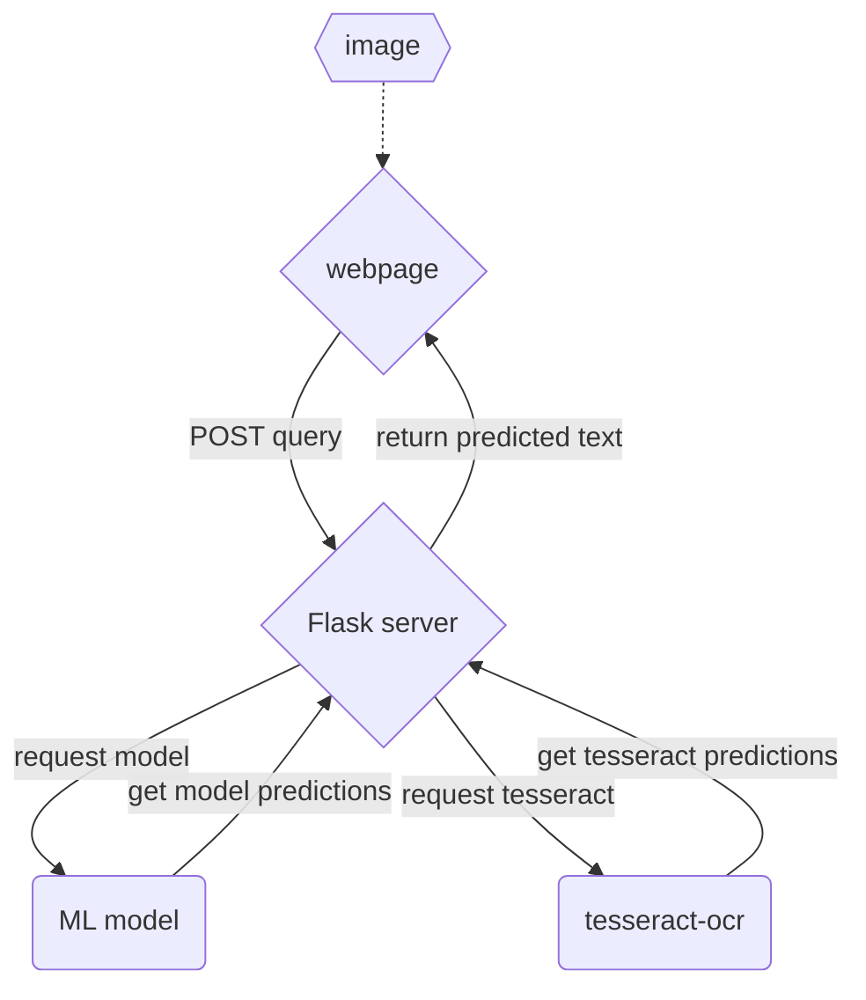

# memeoizer
image to text storage

```mermaid

flowchart TB
    input1{{image}} -.-> fe1{webpage}
    fe1{webpage}-- POST query --> be1{Flask server}
    be1{Flask server} -- return predicted text --> fe1
    be1 -- request model --> be2(ML model)
    be2 -- get model predictions--> be1
    be1 -- request tesseract --> be3(tesseract-ocr)
    be3 -- get tesseract predictions --> be1

```